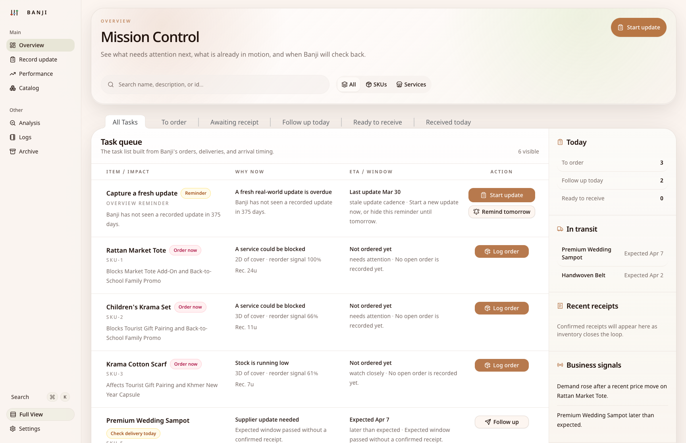
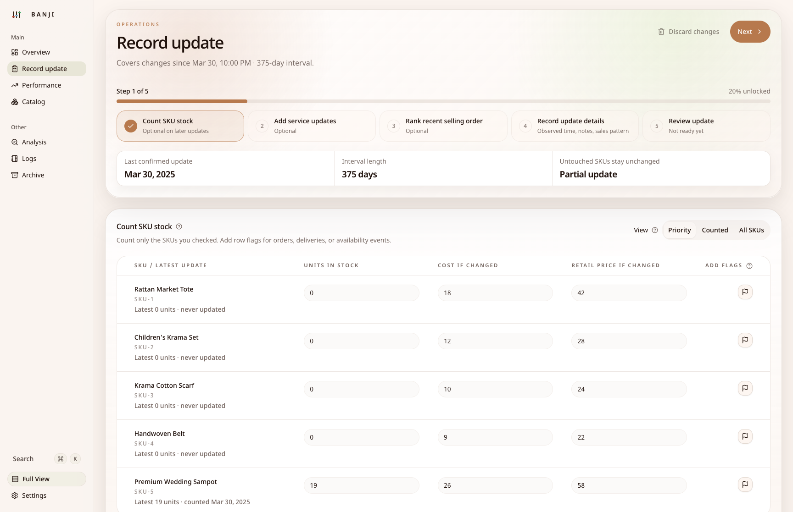
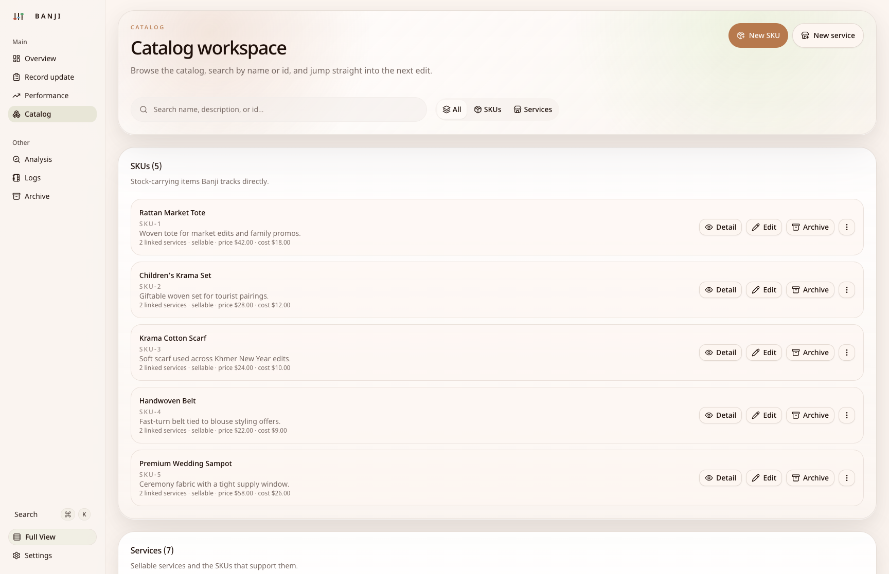
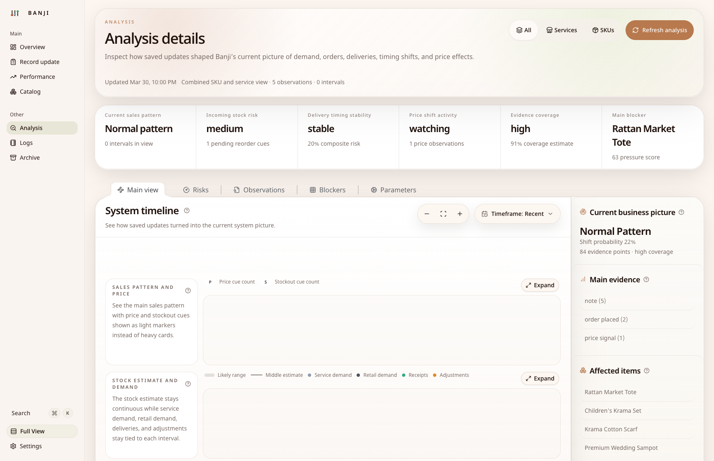

# Banji

Banji is a desktop inventory workspace for small teams that want a local-first tool with built-in analysis.

It is not trying to be a full ERP or a hosted SaaS product. It is a desktop app for keeping a catalog, recording stock changes and real-world signals, and letting Banji's local analysis layer turn those updates into practical next actions.

[Download latest release](https://github.com/Svanny/banji/releases/latest) · [Browse releases](https://github.com/Svanny/banji/releases) · [Report an issue](https://github.com/Svanny/banji/issues)

## Screenshots

| Overview | Record update |
| --- | --- |
|  |  |

| Catalog | Analysis |
| --- | --- |
|  |  |

## What To Expect

- A desktop app with downloadable releases for macOS, Windows, and Linux.
- A bundled local runtime and local workspace storage inside the app.
- A workflow centered on catalog management, update logging, operational follow-up, and analysis.
- A product that is opinionated about Banji's current inventory model rather than a blank-slate platform.
- A repository where the README is for users first and the development notes live lower down.

## What's Included

- Catalog management for SKUs and services.
- A guided record-update flow for stock counts, service updates, ordering signals, delivery timing, and notes.
- Overview and operations surfaces that turn updates into concrete follow-up tasks.
- Analysis views that explain what the current inventory picture seems to be and why.
- Local settings for language and currency, including English and Khmer plus USD and KHR support.

## Current Limits

- Banji is desktop-first.
- Banji is local-first.
- It is not marketed here as a multi-user cloud suite, marketplace tool, or full back-office system.
- It still reflects one specific operating model, so some teams will find it immediately useful and others will find it too opinionated.

## SENA

Banji uses **SENA** as its local analysis engine. SENA is what turns saved observations into reorder pressure, timing risk, blocker detection, and explanation surfaces inside the app.

If you want the reference document, see [References/SENA/SENA.pdf](References/SENA/SENA.pdf).

## Downloads

Releases are published through GitHub Releases:

- macOS: DMG builds for Intel and Apple Silicon
- Windows: x64 installer
- Linux: x64 AppImage and `.deb`

Depending on the platform and release signing status, your OS may show extra trust warnings during install. The release page is the source of truth for the latest downloadable artifacts.

## Development

### Prerequisites

- Node.js 20+
- `pnpm`
- Rust toolchain

Install Node.js 20+ from [nodejs.org](https://nodejs.org/).

Install Rust from [rust-lang.org/tools/install](https://rust-lang.org/tools/install/).

### Install

```bash
pnpm install
```

### Run

```bash
pnpm dev
```

### Tests

```bash
pnpm test
cargo test --manifest-path apps/desktop-core/Cargo.toml
```

### Packaging

```bash
pnpm package:mac
pnpm package:linux
pnpm package:win:native
```
