# Banji

Banji is an inventory platform prototype with:
- A Flutter dashboard/product UI.
- A Rust API workstream (`apps/api`) implementing core backend contracts (Postgres source of truth, idempotency, event log, Redis fail-open cache, RabbitMQ job/outbox patterns).

## What Is Implemented

- Dashboard shell with key metrics, performance, and recent activity sections.
- Inventory domain model with seeded SKU and Service data.
- View All inventory page with filtering, search, and add/edit flows.
- SKU detail and Service detail editors with validation, unsaved-change handling, and SKU linking for services.
- Guided stock update flow with card deck navigation, increment presets, and confirmation/save flow.
- Product ranking page with reorder interactions and save/discard confirmation.
- App settings for language (English, Khmer) and currency (USD, KHR).
- Security utilities for input normalization/validation and opaque ID generation.

## Tech Stack

- Frontend:
  - Flutter (Material)
  - Dart SDK `^3.9.0`
  - `flutter_svg`
  - `flutter_card_swiper`
  - `google_fonts`
- Backend:
  - Rust (`axum`, `sqlx`, `tokio`)
  - PostgreSQL
  - Redis (optional cache/coordination)
  - RabbitMQ (jobs; outbox relay pattern)

## Project Structure

- `lib/main.dart`: app bootstrap, top-level scopes, and routing entry.
- `lib/views/home_view.dart`: dashboard home surface.
- `lib/views/inventory_views.dart`: inventory library and feature parts.
- `lib/views/inventory/`: inventory flows (view all, details, stock update, ranking).
- `lib/views/settings_view.dart`: app settings surface.
- `lib/security/`: shared validation, limits, and ID generation.
- `lib/localization/` and `lib/l10n/`: locale controller and generated/localized strings.
- `test/`: widget, logic, and security tests.
- `tool/security/`: merge-gate security checks.
- `apps/api/`: Rust API service and backend modules.
- `apps/api/migrations/`: SQLx schema migrations.
- `config/env/`: environment variable templates for `dev`, `staging`, `prod`.
- `docs/architecture/`: canonical backend contracts and architecture decisions.
- `tool/`: operational scripts for naming, DB operations, and RabbitMQ operations.
- `tool/edge/`: Cloudflare edge apply/verify tooling and fingerprint references.
- `tool/otel/`: OpenTelemetry collector config for traces/metrics export pipeline.

## Root Docs Index

Root markdown files are intentionally prefixed for grouping and stable sorting:

- `README.md`: project overview and usage.
- `SECURITY.md`: security policy and baseline.
- `20_ARCH_backend-process-diagram.md`: backend process diagram notes.
- `30_RISK_banji-threat-model.md`: threat model.
- `30_RISK_ownership-map-fallback.md`: ownership map fallback analysis.
- `30_RISK_security-best-practices-report.md`: security best-practices report.
- `40_PLAN_todo-backend.md`: backend delivery todo and future considerations.

## System Architecture



Source:
- `SYSTEM_ARCHITECTURE.mmd`

## State and Architecture Notes

- App-level state uses `ValueNotifier` + `InheritedNotifier` scopes:
  - `LocaleController`
  - `CurrencyController`
  - `InventoryController`
- Inventory features are split with `part` files under `lib/views/inventory/` for modular UI + logic.
- Domain entities:
  - `SkuItem`
  - `ServiceItem`

## Localization and Currency

- Locales: English (`en`) and Khmer (`km`).
- Currency switch: `USD` / `KHR`.
- Text resources:
  - `lib/l10n/app_en.arb`
  - `lib/l10n/app_km.arb`

## Security Baseline

Banji enforces a secure-by-default baseline for this prototype:

- Shared validators for text and numeric inputs.
- Hard limits for inventory and monetary values.
- Opaque non-timestamp IDs via secure randomness.
- Secret scanning and platform hardening checks in the security gate.

Primary references:

- `SECURITY.md`
- `docs/security/SECURITY_STANDARDS.md`
- `docs/security/THREAT_MODEL.md`
- `docs/security/SECURITY_TEST_MATRIX.md`

## Getting Started

### Prerequisites

- Flutter SDK installed and on `PATH`
- A supported Flutter target (macOS, iOS, Android, web, Linux, or Windows)

### Install Dependencies

```bash
flutter pub get
```

### Run

```bash
flutter run
```

Example target run:

```bash
flutter run -d macos
```

## Testing

Run all tests:

```bash
flutter test
```

Run inventory-focused tests:

```bash
flutter test test/inventory_pages_test.dart
flutter test test/update_stock_page_test.dart
```

Run security tests only:

```bash
flutter test test/security
```

## Security Gate (Pre-Merge)

```bash
bash tool/security/run_security_checks.sh
```

This gate runs:

1. `flutter analyze`
2. `flutter test test/security`
3. Secret pattern checks
4. Platform hardening checks

## Design Token Sync

If you update `lib/theme/app_theme.dart`, sync exported tokens for references:

```bash
bash tool/sync_design_tokens.sh
```

## Current Status

This repository is an actively evolving prototype.

- Flutter UI flows are implemented for inventory and ranking interactions.
- Backend architecture and infrastructure contracts are being implemented incrementally in the Rust API workstream.
- Rust API milestone baseline includes JWT-authenticated owner-scoped item APIs (`POST /v1/items`, `GET /v1/items/:item_id`) with Postgres-backed idempotent writes and read-through cache behavior.
- Event delivery now uses Postgres outbox-first intent (`app.event_outbox`) with a dedicated relay role (`APP_ROLE=event-relay`) that publishes idempotently into `app.event_log`.
- Inventory projections now use a dedicated `APP_ROLE=projection-consumer` worker that reads `app.event_log`, updates `app.inventory_item_projection`, and resumes from durable checkpoints with single-instance advisory locking.
- Projection replay is now built into the Rust `projection-consumer` runtime (`continuous`, `replay-preview`, `replay-apply`), while public `GET /v1/items/:item_id` still reads the canonical `app.inventory_item` table.
- Controlled replay/backfill is now available via `APP_ROLE=backfill-controller`, which records preview/apply runs in `app.backfill_run`, supports projection rebuilds from `app.event_log`, and schedules replay-scoped jobs into the Rabbit replay exchange.
- Job execution now uses a dedicated `APP_ROLE=worker` runtime that consumes RabbitMQ deliveries, writes `app.job_run` / `app.job_run_attempt` / `app.job_result` accountability records in Postgres, and enforces deterministic `job_key` identity plus duplicate-delivery-safe attempt leases.
- Staging and production now share the same intended backend role topology: `api`, `event-relay`, `projection-consumer`, and `worker`, with deploy checks enforcing role identity and same-image parity.
- Worker job algorithms now use Postgres-backed rollout policy keyed by `job_type`, with sticky `job_run.algorithm_version` decisions so retries stay consistent while new jobs can ramp or roll back immediately.
- Worker artifacts now use S3-compatible object storage with deterministic `artifact_key` / object-key derivation, `HEAD`-first idempotent uploads, and Postgres metadata-only tracking in `app.object_artifact` / `app.job_result_artifact`.
- Observability baseline uses OpenTelemetry semantic-convention HTTP metrics, correlation IDs, and a collector-forwarded traces/metrics path.
- Postgres restore drill routine is defined via `.github/workflows/postgres-restore-drill.yml` and `docs/operations/postgres-restore-drill.md`.
- Postgres event-log lifecycle (retention/archive/replay) is defined via `docs/architecture/postgres-event-log.md` and `docs/operations/postgres-event-log-maintenance.md`.
- Event vocabulary and schema discipline is defined via `docs/architecture/event-vocabulary-schema-discipline.md`.
- Job worker operations are defined via `docs/operations/job-worker-runbook.md`.
- Backfill controller operations are defined via `docs/operations/backfill-runbook.md`.
- Object storage artifact contracts are defined via `docs/architecture/object-storage-artifacts.md` and `docs/operations/object-storage-runbook.md`.
- Edge protection baseline (Cloudflare front door + app-layer guardrails) is defined via `docs/architecture/edge-protections.md` and `docs/operations/edge-operations-runbook.md`.
- Some integration paths remain intentionally staged while contracts and operational tooling are finalized.
