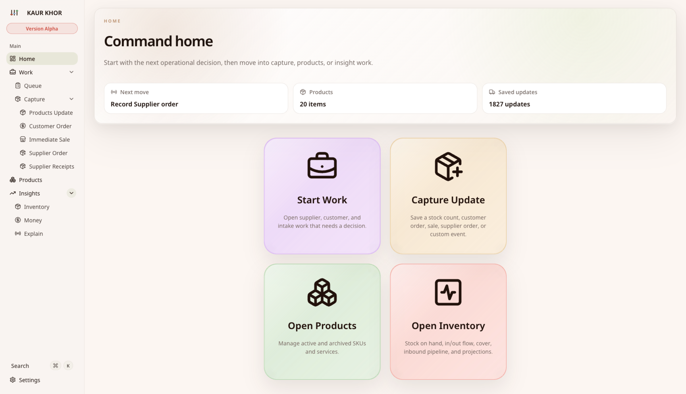
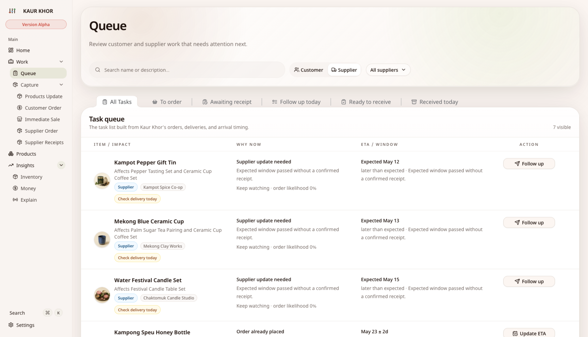
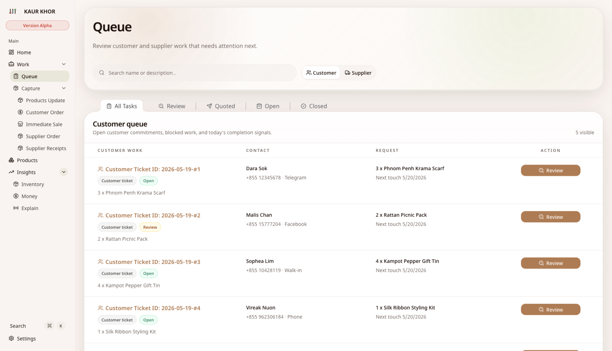
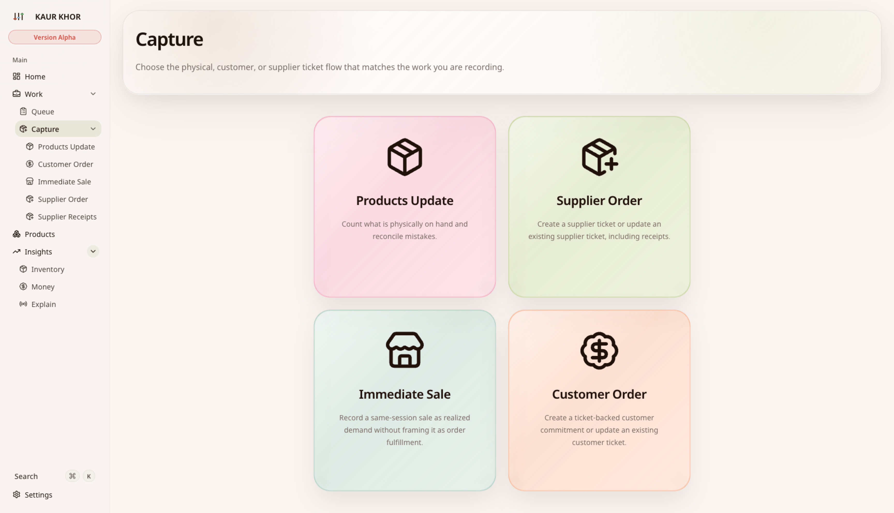
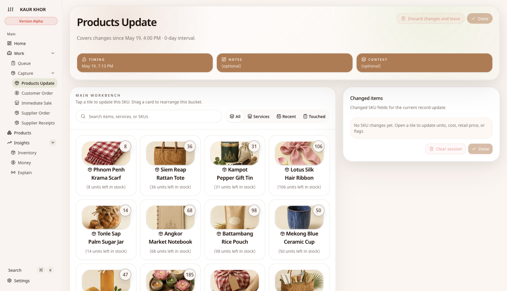
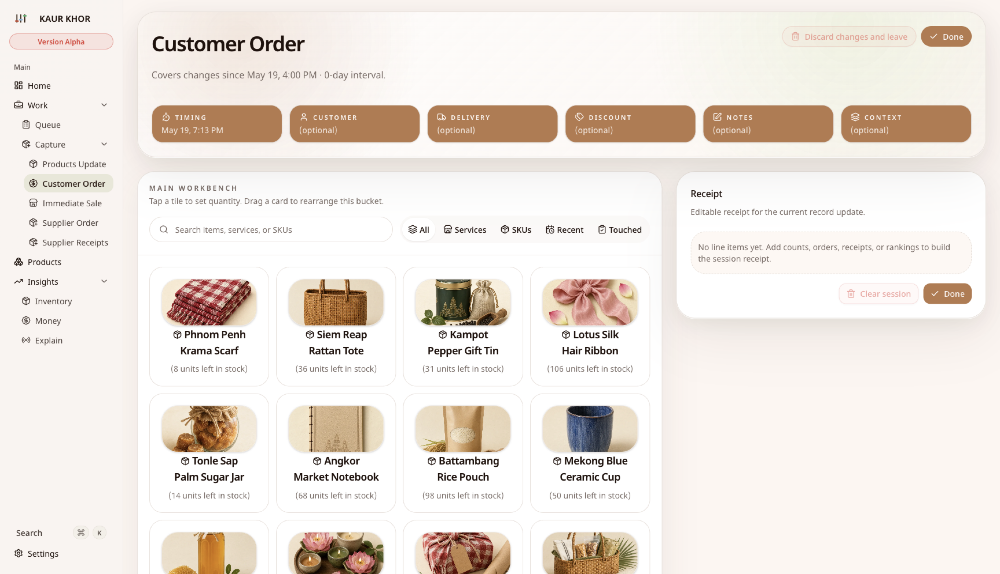
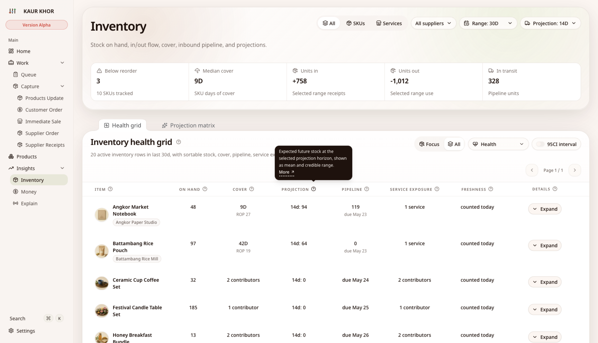
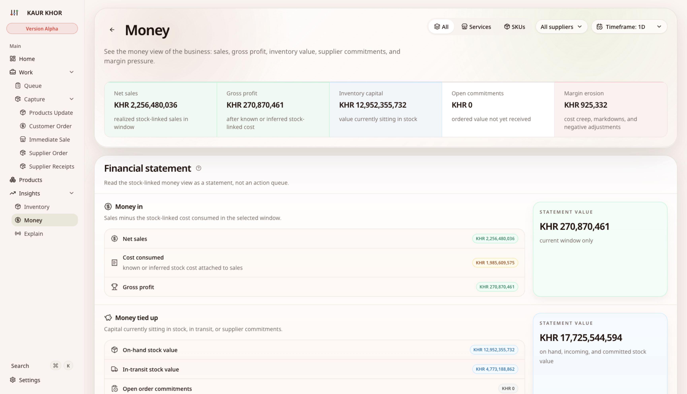
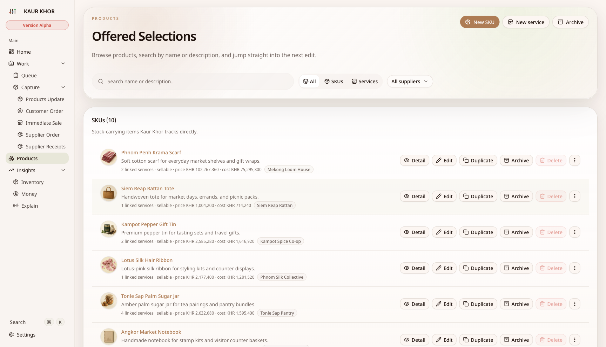
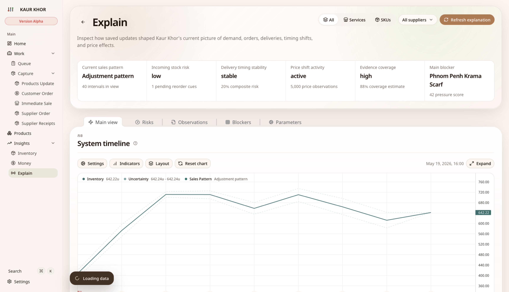

# Kaur Khor

Kaur Khor is a desktop inventory workspace for small teams that want a local-first tool with built-in analysis.

It is not trying to be a full ERP or a hosted SaaS product. It is a desktop app for keeping a catalog, recording stock changes and real-world signals, and letting Kaur Khor's local analysis layer turn those updates into practical next actions.

[Download latest release](https://github.com/Svanny/kaur-khor/releases/latest) · [Browser preview](https://svanny.github.io/kaur-khor/) · [Browse releases](https://github.com/Svanny/kaur-khor/releases) · [Report an issue](https://github.com/Svanny/kaur-khor/issues)

## User Guide

Detailed end-user help lives in:

- English: [docs/user-guide.md](docs/user-guide.md)
- Khmer: [docs/user-guide.km.md](docs/user-guide.km.md)

The guides explain Kaur Khor's current workspaces, lane-based update flows, important buttons and controls, glossary terms, and troubleshooting FAQ. The in-app `Help` page mirrors these docs.

## Screenshots

| Overview | Supplier queue |
| --- | --- |
|  |  |

| Customer queue | Capture hub |
| --- | --- |
|  |  |

| Stock count capture | Customer order capture |
| --- | --- |
|  |  |

| Insights / Pressure | Insights / Money |
| --- | --- |
|  |  |

| Products | Insights / Explain |
| --- | --- |
|  |  |

## What To Expect

- A desktop app with downloadable releases for macOS, Windows, and Linux.
- A bundled local runtime and local workspace storage inside the app.
- A workflow centered on catalog management, lane-based update capture, operational follow-up, money views, and analysis.
- A product that is opinionated about Kaur Khor's current inventory model rather than a blank-slate platform.
- A repository where the README is the top-level overview and the deeper developer docs live in `docs/`.

## Browser Preview

The public web surface is published with GitHub Pages under `/kaur-khor/`:

- Overview: <https://svanny.github.io/kaur-khor/>
- Demo: <https://svanny.github.io/kaur-khor/demo>
- Browser app entry: <https://svanny.github.io/kaur-khor/app>
- Downloads and install notes: <https://svanny.github.io/kaur-khor/#releases>

The demo route uses seeded browser data for preview. Browser storage is tied to the browser profile and is not the same as the desktop app's local data directory. See [docs/browser-app.md](docs/browser-app.md) for details.

Browser app data is stored locally in this browser using SQLite WASM + OPFS when available. Export backups regularly. Clearing browser data may delete your Kaur Khor browser workspace.

Browser mode keeps the main workflow visible, but it is not the desktop runtime. Telegram polling is while-tab-open only, the token is stored in the browser profile, benchmark/dev diagnostics stay desktop-only, and persistent item image assets require desktop.

The public landing page now presents the ways to start in plain user terms:

- Demo: try sample shelves, see the workflow, and reset anytime.
- Browser App: everything in the demo plus real work in this browser, then export and import backups.
- Desktop App: everything in the browser app plus local app files, snapshots, automation, item images, and logs.
- Source Build: everything in the desktop app plus code inspection and a local native source build path.

All entry points are free, require no sign-up or login, and keep data on the user's device.

## What's Included

- Catalog management for SKUs and services.
- A lane-based record-update hub for product updates, customer orders, supplier orders, receipts, and custom combined capture flows.
- Overview and performance surfaces that turn updates into concrete follow-up tasks.
- A financial workspace that turns the same inventory state into money-in, money-tied-up, and money-leaking views.
- An operations workspace for saved update history, heatmap inspection, report editing, and report deletion.
- Insights / Explain and Help views that explain what the current inventory picture seems to be and how Kaur Khor works.
- Local settings for language and currency, including English and Khmer plus USD and KHR support.

## Current Limits

- Kaur Khor is desktop-first.
- Kaur Khor is local-first.
- It is not marketed here as a multi-user cloud suite, marketplace tool, or full back-office system.
- It still reflects one specific operating model, so some teams will find it immediately useful and others will find it too opinionated.

## SENA

Kaur Khor uses **SENA** as its local analysis engine. SENA is what turns saved observations into reorder pressure, timing risk, blocker detection, and explanation surfaces inside the app.

If you want the reference document, see [References/SENA/SENA.pdf](References/SENA/SENA.pdf).

## Downloads

Releases are published through GitHub Releases:

- macOS: DMG builds for Intel and Apple Silicon
- Windows: x64 installer
- Linux: x64 AppImage and `.deb`

Depending on the platform and release signing status, your OS may show extra trust warnings during install. The release page is the source of truth for the latest downloadable artifacts. Release assets follow the repo packaging template `kaur-khor-<version>-<os>-<arch>.<ext>`, matching `electron-builder.yml`.

Verify release downloads against the `SHA256SUMS` asset on the same GitHub Release when it is present. Do not disable Gatekeeper or SmartScreen globally, and do not strip macOS quarantine attributes to force a launch. For more detail, see [docs/install-guide.md](docs/install-guide.md).

### Running Unsigned Builds On macOS

If macOS blocks Kaur Khor because the app is unsigned:

1. Try opening the app with `Control` + click, then choose `Open`.
2. If macOS still blocks it, go to `System Settings` -> `Privacy & Security`, find the Kaur Khor warning near the bottom, and click `Open Anyway`.
3. Re-open the app and confirm the final prompt.

This allows Kaur Khor to run without disabling Gatekeeper globally.

If you need a walkthrough, see this [YouTube tutorial for opening macOS app from unidentified developer](https://youtu.be/sLox8h-6BVw).

### Running Unsigned Builds On Windows

To install Kaur Khor on Windows:

1. Download the `.exe` installer from the latest GitHub release.
2. Double-click the installer to start setup.

If Windows shows a SmartScreen warning because the build is unsigned:

1. Click `More info` in the warning dialog.
2. Click `Run anyway`.
3. Continue through the installer prompts.

This allows Kaur Khor to install without changing SmartScreen system-wide.

### Installing And Running Builds On Linux

If you downloaded the `.deb` package on Ubuntu or Debian:

```bash
sudo apt install ./kaur-khor-<version>-linux-<arch>.deb
```

Example:

- `<version>` is the release version from GitHub Releases
- `<arch>` is the artifact architecture, such as `x64` or `arm64`

If you downloaded the AppImage:

```bash
chmod +x kaur-khor-<version>-linux-<arch>.AppImage
./kaur-khor-<version>-linux-<arch>.AppImage
```

Example:

- `kaur-khor-<version>-linux-x64.AppImage` is for x64 Linux
- `kaur-khor-<version>-linux-arm64.AppImage` is for ARM64 Linux

If Linux blocks the AppImage or warns that it is untrusted:

1. Make the AppImage executable with `chmod +x`.
2. Open the file from a terminal instead of double-clicking it first.
3. If your desktop asks for confirmation, approve the launch for this file.

Kaur Khor does not require disabling Linux security features globally. Most install friction comes from the file not being marked executable yet.

## Development

### Prerequisites

- Node.js 20+
- `pnpm`
- Rust toolchain

Install Node.js 20+ from [nodejs.org](https://nodejs.org/).

Install Rust from [rust-lang.org/tools/install](https://rust-lang.org/tools/install/).

### Install

```bash
pnpm install
```

### Run

```bash
pnpm dev
```

`pnpm dev` opens the current local workspace as-is. Use `pnpm dev:seed` when
you want the development shell to seed the generated demo workspace first.

For phone or tablet checks against the browser surface:

```bash
pnpm run dev:web
```

Use the printed `Network` URL with `/kaur-khor/demo` for LAN HTTP testing. The real `/kaur-khor/app` browser workspace needs a secure browser context for OPFS-backed storage, so plain `http://<LAN IP>:<port>` shows the storage limitation screen instead of storing real app data.

### Web Build

```bash
pnpm run build:web
pnpm run pages:build
pnpm run preview:web
```

### README Screenshots

```bash
pnpm run data:generate:screenshot
pnpm build
pnpm run screenshots:readme
```

The screenshot fixture seeds the bundled 10 SKU / 10 service catalog, plus customer-order ticket examples for the Queue and Customer Order capture screenshots.

### Tests

```bash
pnpm test
pnpm test -- --serial
cargo test --manifest-path apps/desktop-core/Cargo.toml
cargo test --manifest-path apps/sena-core/Cargo.toml
pnpm ui:matrix
```

`pnpm test` runs Vitest files in parallel by default. Use `--serial` or
`KAUR_KHOR_VITEST_SERIAL=1` when isolating shared-state failures. UI matrix runs
independent spec files in parallel while preserving ordered dependent-state
flows inside each spec. Playwright e2e runs independent spec files in parallel
by default; set `KAUR_KHOR_E2E_WORKERS=1` when diagnosing ordering-sensitive
failures.

### Repo Shape

The current local app is organized around these paths:

- `src/main`: Electron main process, app boot, IPC handlers, local data paths, backup and restore behavior
- `src/preload`: preload bridge that exposes `window.kaurKhorDesktop`
- `src/renderer`: React routes, settings flows, workspace UI, and command palette behavior
- `src/renderer/src/routes/web`: public web routes for GitHub Pages
- `src/shared`: shared IPC contracts and TypeScript types
- `apps/desktop-core`: Rust desktop runtime used for local persistence and core workflows
- `apps/sena-core`: Rust SENA analysis engine
- `tool/security`: desktop security gate scripts
- `tool/sync_design_tokens.sh`: design-token sync helper

The repository is licensed under `GPL-2.0-only`.

For contributor-oriented documentation, see [docs/README.md](docs/README.md).

### Packaging

```bash
pnpm package:mac
pnpm package:linux
pnpm package:win:native
pnpm package:source
```

macOS packaging writes artifacts under `release/`, installs the unpacked app from the runnable `release/mac-*` folder into `/Applications`, and can skip that install with `KAUR_KHOR_SKIP_APPLICATIONS_INSTALL=1 pnpm package:mac`.
The source package command writes a production-only source-build archive under `dist/` for end users who want to build the desktop app locally without downloading the full GitHub autogenerated source archive.
