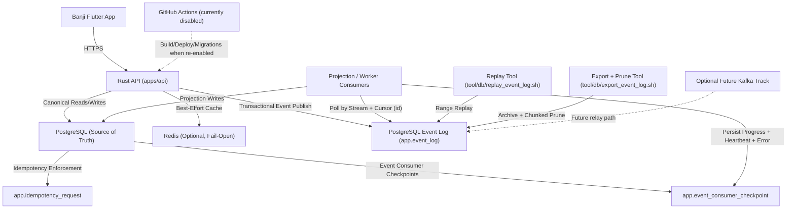

# System Architecture

```mermaid
flowchart TD
    A["Banji Flutter App"] -->|"HTTPS"| B["Rust API (apps/api)"]

    B -->|"Canonical Reads/Writes"| C["PostgreSQL (Source of Truth)"]
    B -->|"Best-Effort Cache"| D["Redis (Optional, Fail-Open)"]

    B -->|"Transactional Event Publish"| E["PostgreSQL Event Log (app.event_log)"]

    C -->|"Idempotency Enforcement"| F["app.idempotency_request"]
    C -->|"Event Consumer Checkpoints"| G["app.event_consumer_checkpoint"]

    H["Projection / Worker Consumers"] -->|"Poll by Stream + Cursor (id)"| E
    H -->|"Persist Progress + Heartbeat + Error"| G
    H -->|"Projection Writes"| C

    I["Replay Tool (tool/db/replay_event_log.sh)"] -->|"Range Replay"| E
    J["Export + Prune Tool (tool/db/export_event_log.sh)"] -->|"Archive + Chunked Prune"| E

    K["GitHub Actions (currently disabled)"] -. "Build/Deploy/Migrations when re-enabled" .-> B

    L["Optional Future Kafka Track"] -. "Future relay path" .-> E
```
